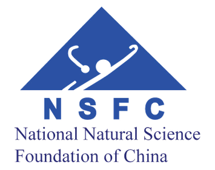

PERIGEE is a nonlinear dynamic finite element analysis code for multiphysics simulation. It is designed as an object-oriented framework for parallel implementations of fluid, solid, and fluid-structure interaction problems. Copyright and licensing information are available in [LICENSE](LICENSE).

## Table of Contents

- [Overview](#overview)
- [Installation](#installation)
- [Configuration](#configuration)
- [Build](#build)
- [Typical Workflow](#typical-workflow)
- [Examples and Tests](#examples-and-tests)
- [Contributing](#contributing)
- [Simulation Samples](#simulation-samples)
- [References](#references)
- [Contact](#contact)
- [Acknowledgement](#acknowledgement)

## Overview

PERIGEE targets UNIX-like systems such as Linux and macOS. Windows users can follow the dedicated guide in [docs/install_guidance_windows.md](docs/install_guidance_windows.md). For additional setup details, see:

- [docs/install_external_libs.md](docs/install_external_libs.md) for a quick dependency installation guide.
- [docs/install-advanced.md](docs/install-advanced.md) for advanced build and dependency guidance.
- [docs/configure_perigee_guide.md](docs/configure_perigee_guide.md) for configuration details.
- [docs/FAQ.md](docs/FAQ.md) for common questions.

## Installation

1. Install the required external libraries by following either the quick guide or the advanced guide linked above.
2. If VTK is installed as a shared library in a non-standard location, update `LD_LIBRARY_PATH` so the runtime linker can find the `.so` files.

Example:

```sh
export LD_LIBRARY_PATH=/Users/juliu/lib/VTK-8.2.0/lib:$LD_LIBRARY_PATH
```

For background information on shared-library lookup paths, see [Program Library HOWTO](http://tldp.org/HOWTO/Program-Library-HOWTO/shared-libraries.html).

## Configuration

After the external libraries are installed, create `conf/system_lib_loading.cmake` for your local machine configuration. The exact structure depends on how you organize machine-specific CMake files, so refer to [docs/configure_perigee_guide.md](docs/configure_perigee_guide.md) for the expected workflow and variables.

At a minimum, make sure your configuration provides the following variables:
   - `VTK_DIR`: path to the VTK installation (for example, `/home/jliu/lib/VTK-7.1.1-shared`).
   - `PETSC_DIR`: path to the PETSc installation (for example, `/home/jliu/lib/petsc-3.11.3`).
   - `PETSC_ARCH`: PETSc architecture name used during installation (for example, `arch-linux2-c-debug`).
   - `METIS_DIR`: path to the METIS installation.
   - `HDF5_DIR`: path to the HDF5 installation.
   - `CMAKE_C_COMPILER`: usually `$PETSC_DIR/$PETSC_ARCH/bin/mpicc`.
   - `CMAKE_CXX_COMPILER`: usually `$PETSC_DIR/$PETSC_ARCH/bin/mpicxx`.

`conf/system_lib_loading.cmake` is intentionally ignored by Git, so your local machine-specific settings stay untracked. If you switch branches frequently, keeping a backup copy outside the repository is recommended.

## Build

Create a build directory outside an example source tree, then point CMake to the example you want to compile. For example, to build the Navier-Stokes example suite:

```sh
mkdir -p build
cd build
cmake ../examples/ns
make
```

To build an optimized version instead of the default debug build:

```sh
cmake ../examples/ns -DCMAKE_BUILD_TYPE=Release
make
```

Notes:

- Check the printed value of `CMAKE_BUILD_TYPE` after configuring.
- Optimized application builds work best when key external libraries, especially PETSc, are also built in optimized mode.
- You can speed up compilation with parallel builds, for example `make -j2`.
- If your compiler reports errors related to `auto` or `nullptr`, ensure your toolchain supports C++11 and set `CMAKE_CXX_STANDARD 11` where appropriate in your CMake configuration.

## Typical Workflow

A typical simulation pipeline in PERIGEE is:

1. Generate a mesh in `vtu`/`vtp` format using a front-end tool such as SimVascular or Gmsh.
2. Run a preprocessing step to load the mesh, apply boundary conditions, and partition the domain. This step is serial and may require a high-memory node for very large problems.
3. Run the finite element solver to compute the solution. Results are written to disk in binary form.
4. Run the pre-postprocessing step to repartition the mesh for postprocessing tasks such as visualization or error analysis. This step is also serial and can be memory-intensive.
5. Run the postprocessor in parallel to write visualization data, typically in parallel `vtu`/`vtp` format for ParaView.

This workflow allows the solve and visualization stages to use different processor counts. For example, a simulation may run on hundreds of CPUs, while visualization can be performed efficiently on far fewer ranks.

## Examples and Tests

The repository includes several example applications under `examples/`, including:

- `examples/linearPDE` for linear PDE examples.
- `examples/ns` for Navier-Stokes examples.
- `examples/fsi` for fluid-structure interaction examples.
- `examples/ale_ns_rotate` for ALE Navier-Stokes examples with rotation.
- `examples/test` for test targets.

Build each example suite by pointing CMake at the corresponding directory.

## Contributing

Contributions are welcome.

### Code Style

- Follow the [Google C++ Style Guide](https://google.github.io/styleguide/cppguide.html).
- Write clear, focused commits.
- Document non-obvious logic with concise comments.
- Keep each pull request scoped to a single feature, fix, or refactor whenever possible.

### Testing

- Add or update tests when your changes affect behavior.
- Run relevant tests before submitting a pull request.
- Confirm that your changes do not break existing functionality.

### Issues and Pull Requests

- Open an issue for bugs, regressions, or feature requests when appropriate.
- Include reproduction steps, expected behavior, and relevant logs for bug reports.
- Update documentation, including this README, when your changes affect setup or usage.

### Community

- Be respectful and constructive in discussions and code review.
- Follow the project's [Code of Conduct](CODE_OF_CONDUCT.md) if applicable.

## Simulation Samples

The vortex-induced vibration of an elastic plate with Re $\approx 3 \times 10^4$. The mesh consists of 18 million linear tetrahedral elements for the fluid and 0.7 million elements for the solid. The variational multiscale formulation provides the LES capability for the flow problem, and time integration is based on the generalized-$\alpha$ scheme.

[](https://www.youtube.com/watch?v=QiSkyBMGhmI "Vortex induced vibration")

A fluid-structure interaction simulation of a pulmonary model is performed using the **unified continuum and variational multiscale formulation**. The model and mesh were prepared by W. Yang. The solid model is *fully incompressible* and is solved numerically with a residual-based variational multiscale formulation.

[](https://www.youtube.com/watch?v=Y84vSN64ZCk "Pulmonary FSI")

## References

### Theory

- J. Liu and A.L. Marsden, [A unified continuum and variational multiscale formulation for fluids, solids, and fluid-structure interaction](https://doi.org/10.1016/j.cma.2018.03.045), *Computer Methods in Applied Mechanics and Engineering*, 337:549-597, 2018.
- I.S. Lan, J. Liu, W. Yang, and A.L. Marsden, [A reduced unified continuum formulation for vascular fluid-structure interaction](https://doi.org/10.1016/j.cma.2022.114852), *Computer Methods in Applied Mechanics and Engineering*, 394:114852, 2022.
- J. Liu, I.S. Lan, O.Z. Tikenogullari, and A.L. Marsden, [A note on the accuracy of the generalized-$\alpha$ scheme for the incompressible Navier-Stokes equations](https://doi.org/10.1002/nme.6550), *International Journal for Numerical Methods in Engineering*, 122:638-651, 2021.

### Solver Technology

- J. Liu, W. Yang, M. Dong, and A.L. Marsden, [The nested block preconditioning technique for the incompressible Navier-Stokes equations with emphasis on hemodynamic simulations](https://doi.org/10.1016/j.cma.2020.113122), *Computer Methods in Applied Mechanics and Engineering*, 367:113122, 2020.
- Y. Sun, Q. Lu, and J. Liu, [A parallel solver framework for fully implicit monolithic fluid-structure interaction](https://doi.org/10.1007/s10409-024-24074-x), *Acta Mechanica Sinica*, 40:324074, 2024.

### Verification and Validation

- I.S. Lan, J. Liu, W. Yang, J. Zimmermann, D.B. Ennis, and A.L. Marsden, [Validation of the reduced unified continuum formulation against in vitro 4D-flow MRI](https://doi.org/10.1007/s10439-022-03038-4), *Annals of Biomedical Engineering*, 51:377-393, 2023.
- J. Liu, W. Yang, I.S. Lan, and A.L. Marsden, [Fluid-structure interaction modeling of blood flow in the pulmonary arteries using the unified continuum and variational multiscale formulation](https://doi.org/10.1016/j.mechrescom.2020.103556), *Mechanics Research Communications*, 107:103556, 2020.

### Applications

- Y. Sun, J. Huang, Q. Lu, X. Yue, X. Huang, W. He, Y. Shi, and J. Liu, [Modeling fibrous tissue in vascular fluid-structure interaction: a morphology-based pipeline and biomechanical significance](https://doi.org/10.1002/cnm.3892), *International Journal for Numerical Methods in Biomedical Engineering*, 41(1):e3892, 2025.
- X. Yue, J. Huang, and J. Liu, [Fluid-structure interaction analysis for abdominal aortic aneurysms: the role of multi-layered tissue architecture and intraluminal thrombus](https://doi.org/10.3389/fbioe.2025.1519608), *Frontiers in Bioengineering and Biotechnology*, 13:1519608, 2025.

### HPC

- D. Goldberg, *What Every Computer Scientist Should Know About Floating-Point Arithmetic*.
- U. Drepper, *What Every Programmer Should Know About Memory*.

### C++

- [Learn C++](http://www.learncpp.com).
- [Google C++ Style Guide](https://google.github.io/styleguide/cppguide.html).
- [C++ Core Guidelines](https://isocpp.github.io/CppCoreGuidelines/CppCoreGuidelines).

## Contact

[Dr. Ju Liu](https://ju-liu.github.io)  
liujuy@gmail.com  
liuj36@sustech.edu.cn

## Acknowledgement

National Natural Science Foundation of China, Grant numbers 12172160 and 12472201.

Shenzhen Science and Technology Program, Grant number JCYJ20220818100600002.


